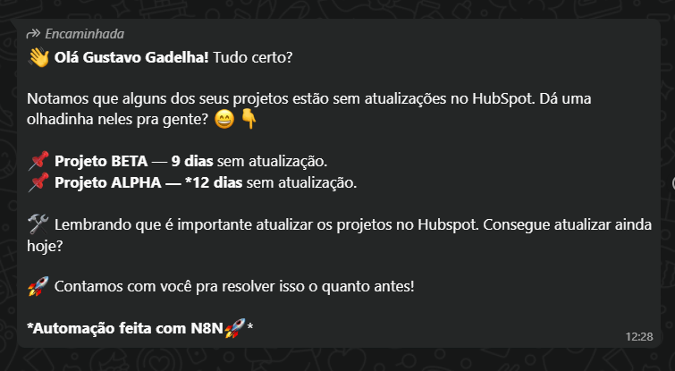
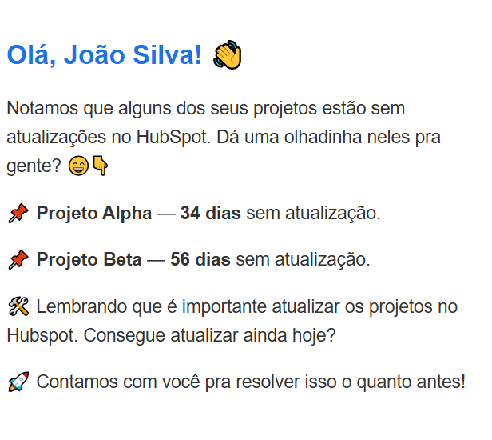

# 🚀 Automação de Lembretes de Projetos

## 🛠 Stacks Utilizadas
- **n8n**: Orquestração de automações.  
- **PostgreSQL**: Banco de dados.  
- **HubSpot API**: Consulta de projetos e usuários.  
- **Evolution API**: Envio de mensagens via WhatsApp.  
- **Gmail API**: Envio de e-mails.  
- **JavaScript**: Transformação de dados e formatação de mensagens.

---

## 🔄 Fluxo de Automação (resumido)

1. **Trigger Agendado**: Dispara a automação semanalmente.  
2. **Consulta HubSpot**: Busca projetos, informações dos consultores e próximas atividades na agenda.  
3. **Tratamento de Dados**: Calcula dias sem atualização, organiza informações e verifica próximas atividades.  
4. **Filtragem**: Seleciona projetos sem atualizações há mais de 7 dias e atividades futuras.  
5. **Merge e Preparação**: Une dados de usuários, projetos e atividades, formata a mensagem.  
6. **Envio**: Mensagens automáticas enviadas via WhatsApp e e-mail.  

> ⚠️ Substitua todas as chaves de API (HubSpot, Evolution e Gmail) pelas suas credenciais.

---

## 📷 Visual do fluxo no n8n


---

## ✉️ Mensagem enviada (WhatsApp / E-mail)



> Se o consultor tiver próximas atividades com leads marcadas na agenda, a mensagem inclui um alerta com quantos dias faltam para cada atividade.

---

## ✉️ Mensagem Fomatada no E-mail (Usando HTML)



---

# 🛠️ Estrutura HTML (com dados dinâmicos e alertas)

```html
<!DOCTYPE html>
<html>
<head>
  <meta charset="UTF-8" />
  <title>Lembrete de Projetos</title>
</head>
<body style="background-color: #ffffff; padding: 20px; font-family: Arial, sans-serif; color: #333;">
  <div style="max-width: 600px; margin: auto; border-radius: 8px; border: 1px solid #ddd; padding: 24px; text-align: left;">
    <h1 style="color: #1a73e8; font-size: 22px; font-weight: bold; margin-bottom: 20px;">
      Olá, {{ $('Formata Mensagem').item.json.nomeConsultor }}! 👋
    </h1>
    <div style="font-size: 15px; line-height: 1.6;">
      <p>Notamos que alguns dos seus projetos estão sem atualizações no HubSpot. Dá uma olhadinha neles pra gente? 😄👇</p>

      {{#each $('Formata Mensagem').item.json.projetos }}
        <p>📌 <b>{{ this.nomeProjeto }}</b> — <b>{{ this.diasSemAtualizacao }} dias</b> sem atualização.</p>
      {{/each}}

      {{#if $('Formata Mensagem').item.json.proximasAtividades }}
        <p>⏰ Próximas atividades na agenda:</p>
        {{#each $('Formata Mensagem').item.json.proximasAtividades }}
          <p>• {{ this.nomeLead }} — <b>{{ this.diasRestantes }} dias</b> restantes</p>
        {{/each}}
      {{/if}}

      <p>🛠️ Lembrando que é importante atualizar os projetos no Hubspot. Consegue atualizar ainda hoje?</p>
      <p>🚀 Contamos com você pra resolver isso o quanto antes!</p>
      <p><b>Automação feita com n8n🚀</b></p>
    </div>
  </div>
</body>
</html>
```

# Para as próximas atividades do consultor marcadas no CRM HubSpot, ele receberá o seguinte alerta, tanto no WhatsApp quanto no Gmail, com a estrutura:  
# 
