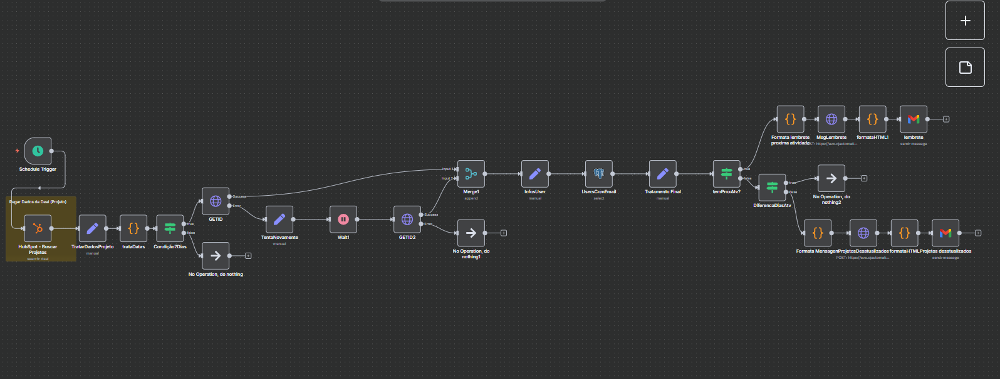

# Automação de Lembretes de Projetos

## 🛠 Stacks Utilizadas
- **n8n**: Orquestração de automações.
- **PostgreSQL**: Banco de dados.
- **HubSpot API**: Consulta de projetos e usuários.
- **Evolution API**: Envio de mensagens via WhatsApp.
- **Gmail API**: Envio de e-mails.
- **JavaScript**: Transformação de dados e formatação de mensagens.

---

## 🔄 Fluxo de Automação (resumido)

1. **Trigger Agendado**: Dispara a automação semanalmente.  
2. **Consulta HubSpot**: Busca projetos e informações dos consultores.  
3. **Tratamento de Dados**: Calcula dias sem atualização e organiza informações.  
4. **Filtragem**: Seleciona projetos sem atualizações há mais de 7 dias.  
5. **Merge e Preparação**: Une dados de usuários e projetos, formata a mensagem.  
6. **Envio**: Mensagens automáticas enviadas via WhatsApp e e-mail.  
> ⚠️ Substitua todas as chaves de API (HubSpot, Evolution e Gmail) pelas suas credenciais.

---

## 📷 Visual do fluxo no n8n



---

## ✉️ Mensagem enviada (WhatsApp / E-mail)

```markdown
👋 *Olá João Silva!* Tudo certo?

Notamos que alguns dos seus projetos estão sem atualizações no HubSpot. Dá uma olhadinha neles pra gente? 😄👇

📌 *Projeto Alpha* — *34 dias* sem atualização.
📌 *Projeto Beta* — *56 dias* sem atualização.

🛠️ Lembrando que é importante atualizar os projetos no Hubspot. Consegue atualizar ainda hoje? 

🚀 Contamos com você pra resolver isso o quanto antes!
